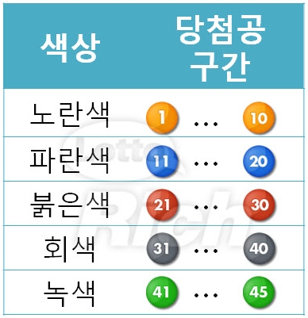

# 프로젝트 09 - JS 라이브러리를 활용해 '로또 추천 번호 생성' 웹 구현

## 과정
- [목표](#목표)
- [준비 사항](#준비-사항)
- [요구사항](#요구-사항)
- [프로젝트 결과 완성본](#프로젝트-결과-완성본)
- [프로젝트 후기](#프로젝트-후기)

## 목표
- HTML를 통한 웹 페이지 마크업
- CSS를 통한 선택자 활용 및 속성 부여
- 로또 추천 생성 레이아웃 구성
- JS를 통한 동적인 요소 부여

## 준비 사항
1. **(필수)** HTML/CSS/JS 환경 구성
2. **(필수)** lodash 라이브러리

## 요구 사항
- 버튼을 눌렀을 때 번호 6개를 추천하는 코드를 작성합니다.
- 숫자별로 적절한 색상을 활용합니다.
  
  

- 사용자에게 정보를 받아 주어진 수량의 번호를 한번에 제공합니다. 

## 프로젝트 결과 완성본

- 깃헙 페이지 링크: <>

## 프로젝트 후기

오늘은 lodash라는 JS 라이브러리를 활용해 로또 추천 번호를 생성해주는 웹을 구현해보았다. 사용자가 로또 추천 번호 생성 개수를 클릭한 후, 버튼을 누르면 아래 추천 결과란에 해당 개수만큼 6개의 랜덤 번호가 뜨게 했다. 또한 클릭한 당시의 날짜와 시간도 함께 보이도록 했다. lodash 라이브러리에서 sampleSize() 함수를 이용해 1 ~ 45번 중 6개의 번호를 랜덤으로 선택했다. 

여기서 한가지 놓쳤던게 있었는데, 생성 개수를 선택해 클릭한 후 곧이어 다시 생성 개수를 선택해 클릭할 때, 앞의 로또 번호들이 지워지지 않고 그 아래에 새로운 로또 번호들이 추가됐다. 이를 해결하기 위해, 버튼을 클릭하면 기존의 로또 번호들은 모두 지워지도록 코드를 작성했다. 

처음에 로또 번호가 나타나는 부분의 너비를 브라우저 너비의 90%로 잡았었는데, 이렇게 하니 뷰포트가 커질 때 로또 번호 박스 양 옆에 공간이 너무 비어보여 반응형을 고려한 코드를 추가로 작성해주었다. 스크린 너비가 768px, 1024px을 기점으로 width를 각각 다르게 설정해주었다.

현재 완성본에 조금 더 추가하고 싶었던게 있다면, 버튼을 클릭했을때 바로 랜덤 번호들이 뜨게 하지 않고 '로딩'모양의 애니메이션(또는 비디오)을 1~2초 정도 보여준 후 번호들이 뜨게끔 해보면 좋을 것 같다.